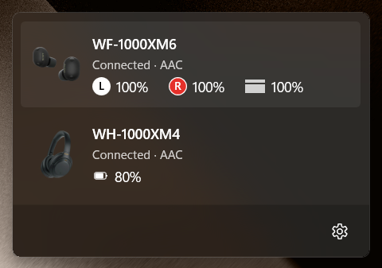
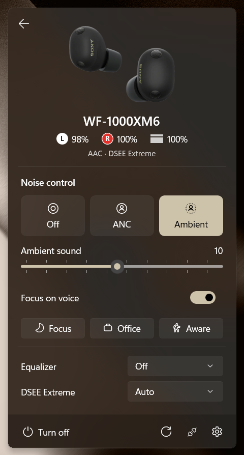
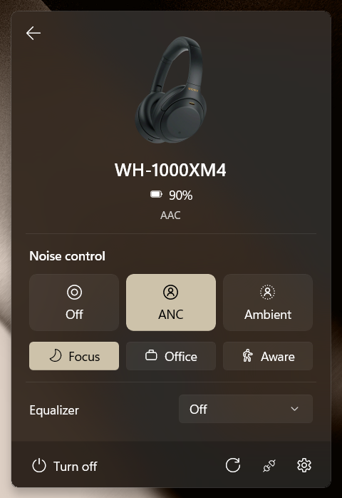

<p align="center">
    
</p>

# Sony Control

A Windows 11 tray app that controls Sony headphones from a native WinUI flyout.

| Headphones | WF-1000XM6 | WH-1000XM4 |
| :---: | :---: | :---: |
|  |  |  |

## Tested & Supported headphones:

- WF-1000XM
- WH-1000XM4

In theory, since we're using [sony-device-center](https://github.com/marconvcm/sony-device-center) from [marconvcm](https://github.com/marconvcm), the headphones supported there should work here. If not, open an issue and I'll investigate

## Installing

Grab the latest release from the [Releases](https://github.com/artistro08/sony-control/releases) page.

## Building From Source

### Prerequisites

- Windows 11 22H2 or newer
- Visual Studio 2026 with these workloads and components:
  - Desktop development with C++ (plus the ARM64 build tools)
  - .NET desktop development
  - Windows App SDK C# and C++ templates

You can install Visual Studio with everything in one go:

```powershell
winget install --id Microsoft.VisualStudio.Community --exact --override "--wait --passive --add Microsoft.VisualStudio.Workload.NativeDesktop --add Microsoft.VisualStudio.Workload.ManagedDesktop --add Microsoft.VisualStudio.ComponentGroup.WindowsAppSDK.Cs --add Microsoft.VisualStudio.ComponentGroup.WindowsAppSDK.Cpp --add Microsoft.VisualStudio.Component.VC.Tools.ARM64 --add Microsoft.VisualStudio.Component.Windows11SDK.26100 --includeRecommended"
```

### Building

Build everything and run the tests:

```powershell
.\scripts\Build.ps1
```

XM4 tests are left out by default; add `-IncludeXm4` to run them.

To test against real headphones, set their Bluetooth address first. The hardware tests are skipped without it:

```powershell
$env:SONY_TEST_XM6_ADDRESS = "AC:80:0A:12:34:56"
.\scripts\Build.ps1
```

### Packaging

1. Once, from an elevated PowerShell, create and trust the signing certificate:

    ```powershell
    .\scripts\New-DevCertificate.ps1
    ```

2. Build the signed MSIX packages only:

    ```powershell
    .\scripts\Build-Package.ps1
    ```

    Or build every release file (MSIX and MSI, x64 and ARM64, plus the certificate) into `artifacts\release`:

    ```powershell
    .\scripts\Build-Release.ps1 -Version 1.1.0.0
    ```

## License

MIT, see [LICENSE](LICENSE). The Bluetooth protocol code is based on [sony-device-center](https://github.com/marconvcm/sony-device-center), also MIT; its notice is in [LICENSE-THIRD-PARTY](LICENSE-THIRD-PARTY).

> Sony and the product names are trademarks of Sony Group Corporation. This is an unofficial app, not made or endorsed by Sony.
